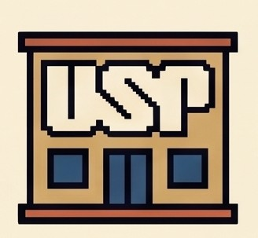
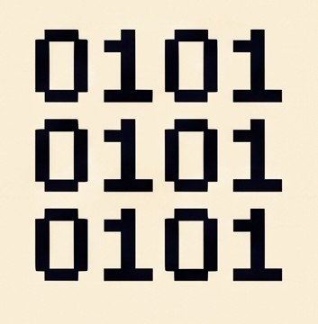

  

 

>   **Interdisciplinary researcher bridging Education, Law, History, and Digital Humanities.**

 I am a PhD candidate in Education at the University of São Paulo (USP) and an undergraduate student in Law. My research explores the intersection of education and state violence, the memory of the Brazilian civil-military dictatorship, and the preservation of historical collections. I leverage programming and data science to build tools for archival curation, knowledge organization, and social data visualization.

### What I am currently working on

-  **Research:** Organizing and describing documentary archives related to state violence and Human Rights. Latest funded project by FAPESP can be visited [here](https://bv.fapesp.br/pt/bolsas/230753/organizacao-e-disponibilizacao-publica-de-acervo-documental-envolvendo-violencia-de-estado/)
-  **Development:** Building open-source tools for digital humanities, batch processing, and archival preservation.
-  **Studies:** Exploring semantic web ontologies (CIDOC-CRM), legal data, and structured databases.

---

### Languages & Technologies

  
  
  
  
  
  

---

###  Featured Projects

| Project | Description | Stack |
| :--- | :--- | :--- |
|  **[Atlas of Resistance](https://github.com/mmillenaa/atlas-of-resistance)** | A knowledge graph platform (CIDOC-CRM) mapping the state’s repressive apparatus during the dictatorship. | `R` `SPARQL` |
|  **[Mnema 1.0](https://github.com/mmillenaa/mnema)** | A lightweight tool for batch renaming digital files in historical collections (FGV Law SP). | `R` |
|  **[Arquivivo](https://github.com/mmillenaa/arquivivo)** | An educational game about archival cataloging, preservation, and protecting collective memory. | `JavaScript` |
|  **[Inventory and Statistics](https://github.com/mmillenaa/inventory-and-statistics)** | An application designed for statistical analyses of structured archival description databases. | `Python` |

---

### Latest Publications

Franco, M. M. (2021). Apropriação das classes nouvelles francesas: experimentações educacionais brasileiras (1949-1969). *RIDPHE_R Revista Iberoamericana do Patrimônio Histórico-Educativo*, 7, e021036-19. DOI: https://doi.org/10.20888/ridpher.v7i00.16064

Franco, A. V. T. M., Franco, M. M., & Franco, I. M. (2026). Unequal sanitation in the Global South: infrastructure and governance shortfalls in northern Minas Gerais, Brazil. *Utilities Policy*. DOI: https://doi.org/10.1016/j.jup.2026.102343

Franco, M. M. (2026). *Ginásios Vocacionais noturnos comparando a efetivação de propostas para a formação cidadã de pessoas jovens e adultas trabalhadoras (1968-9)* [Comparing the implementation of projects for Citizenship Education in Evening Vocational Schools for Youth and Adult Workers (1968–9)] (1st ed.). São Paulo: Millena Miranda Franco. ISBN: [978-65-01-94968-0.](https://www.cblservicos.org.br/isbn/pesquisa/?page=1&q=978-65-01-94968-0&filtrar_por%5B0%5D=isbn&ord%5B0%5D=relevancia&dir%5B0%5D=asc)

Franco, M. M. (2026). *Ideias para a organização de fontes históricas em Direito e Violência de Estado: documento nato-digital e digitalizado* [Ideas for Organizing Historical Sources in Law and State Violence: Born-Digital and Digitized Documents]. DOI: [10.5281/zenodo.22150328](https://doi.org/10.5281/zenodo.22150328)

---
### Let's connect

---

  

