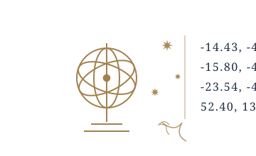

  <picture>
    <source media="(prefers-color-scheme: dark)" srcset="./assets/top-constellation-dark.svg">
    
  </picture>

<h1 align="center">Millena Miranda Franco</h1>

<i>I am glad you are here.</i>

Researcher in the field of Education, Law, History, and Digital Humanities

  <picture>
    <source media="(prefers-color-scheme: dark)" srcset="./assets/moon-divider-thin-dark.svg">
    
  </picture>

|  |  |
|---|---|
|  I am a **PhD candidate in Education at the University of São Paulo (USP)** and an undergraduate student in **Law**.  My research intersects **education and state violence**, the **memory of the Brazilian civil-military dictatorship**, and the **preservation of historical collections**.  I also leverage **programming and data science** to build tools for **archival curation**, **knowledge organization**, and **social data visualization**.  | 
<picture><source media="(prefers-color-scheme: dark)" srcset="./assets/armillary-panel-dark.svg"></picture>
 |

  <picture>
    <source media="(prefers-color-scheme: dark)" srcset="./assets/section-divider-dark.svg">
    
  </picture>

## Languages & technologies

  
  
  
  
  
  

  <picture>
    <source media="(prefers-color-scheme: dark)" srcset="./assets/section-divider-dark.svg">
    
  </picture>

## Latest publications

- **Franco, A. V. T. M., Franco, M. M., & Franco, I. M. (2026).** *Unequal sanitation in the Global South: infrastructure and governance shortfalls in northern Minas Gerais, Brazil.* **_Utilities Policy_**. DOI: [10.1016/j.jup.2026.102343](https://doi.org/10.1016/j.jup.2026.102343)

- **Franco, M. M. (2026).** *Ginásios Vocacionais noturnos comparando a efetivação de propostas para a formação cidadã de pessoas jovens e adultas trabalhadoras (1968–9).* [*Comparing the implementation of projects for Citizenship Education in Evening Vocational Schools for Youth and Adult Workers (1968–9)*]. 1st ed. São Paulo: Millena Miranda Franco. ISBN: [978-65-01-94968-0](https://www.cblservicos.org.br/isbn/pesquisa/?page=1&q=978-65-01-94968-0&filtrar_por%5B0%5D=isbn&ord%5B0%5D=relevancia&dir%5B0%5D=asc)

- **Franco, M. M. (2026).** *Ideias para a organização de fontes históricas em Direito e Violência de Estado: documento nato-digital e digitalizado.* [*Ideas for Organizing Historical Sources in Law and State Violence: Born-Digital and Digitized Documents*]. DOI: [10.5281/zenodo.22150328](https://doi.org/10.5281/zenodo.22150328)

- **Franco, M. M. (2021).** Apropriação das classes nouvelles francesas: experimentações educacionais brasileiras (1949–1969). **_RIDPHE_R Revista Iberoamericana do Patrimônio Histórico-Educativo_**, 7, e021036-19. DOI: [10.20888/ridpher.v7i00.16064](https://doi.org/10.20888/ridpher.v7i00.16064)

  <picture>
    <source media="(prefers-color-scheme: dark)" srcset="./assets/section-divider-dark.svg">
    
  </picture>

## Let's connect

  
  
  
  

  <picture>
    <source media="(prefers-color-scheme: dark)" srcset="./assets/footer-ornament-dark.svg">
    
  </picture>

